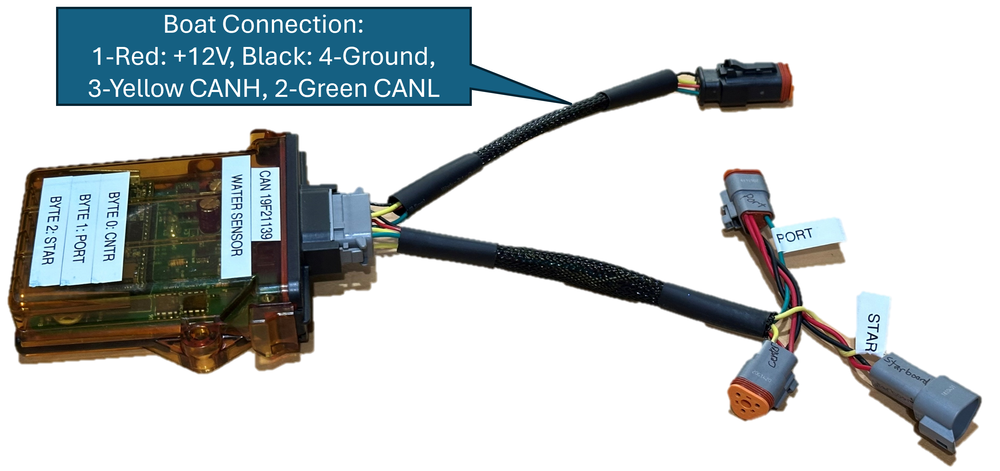

# Water Level Sensor System
An Arduino-based project with a Teensy 3.6 to detect the presence of water in pipes and broadcast the message over CAN@250k every 100ms.

We need to sense if water is in the ballast pumps and make sure we don't run the pumps dry.

## Wiring 

### Sensor Wiring
According to the datasheet, there are 4 wires from the sensor. Only three are used and connected to some 3-way tan signal wiring. The signals are as follows:
* Signal (open collector): Sensor is yellow -> signal cable is white. 
* VCC (+5V): Sensor is brown -> signal cable is tan.
* Ground: Sensor is blue -> signal cable is black.

### Electronic Control Unit Wiring
The ECU utilizes a Deutsch DTM05-12s twelve position plug to interface with the ECU. The pinouts are as follows:
1. +12V Raw from boat power
2. +5V Out to power sensors
3. J1939 CAN Low
4. Not Connected
5. Not Connected
6. Starboard Sensor
7. Port Sensor
8. Center Sensor
9. Not Connected
10. J1939 CAN High
11. Ground for Sensors
12. Ground from boat

Since each sensor needs it's own power and ground, a junction harness provides a split and three different 3-way connectors.

The breakout harness has the following connectors and pinouts:
* Starboard Sensor: DT04-3P (pins) with A:+5V, B:Ground, C:Signal 
* Port Sensor: DT06-3S (sockets) with A:+5V, B:Ground, C:Signal
* Center Sensor: DT06-3S (sockets) with A:+5V, B:Ground, C:Signal

## Sensor
The sensors are mounted on the intake tubes of each ballast pump. The sensors were sourced from Amazon at this link: 
https://a.co/d/2jk822a

Taidacent Non Contact Liquid Level Sensor Contactless Water Level Sensor Externally Attached Pipe Water Float Switch NPN Output Capacitive 

There are three sensors and three pumps:
1. Center - mounted in starboard front of the engine compartment.
1. Port - mounted on the boat's left side behind the panel in the trunk.
2. Starboard - mounted on the boat's left side behind the panel in the trunk.

