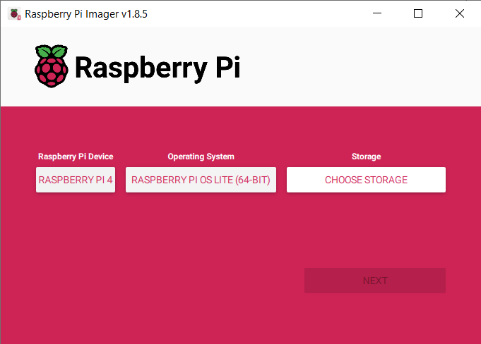

# Human Machine Interface (HMI) for the Autopilot
A project to automatically control filling Steering on a surf boat

## Services needed

`sudo apt install python3-eventlet`


```
nano .config/systemd/user/kiosk-browser.service
```

```
kiosk-browser.service  – Chromium kiosk for X11 sessions
[Unit]
Description=Chromium in kiosk mode (X11)
After=graphical-session.target

[Service]
Type=simple
Environment=DISPLAY=:0
ExecStartPre=/bin/bash -c 'source /home/jdaily/.xprofile'
ExecStart=/usr/bin/chromium-browser \
          --kiosk \
          --incognito \
          --noerrdialogs \
          --disable-restore-session-state \
          --disable-session-crashed-bubble \
          --overscroll-history-navigation=0 \
          --disable-pinch \
          http://localhost:5000/
Restart=on-failure
RestartSec=2
```

```
nano ~/.xprofile
```

```
xrandr --output HDMI-1 --rotate left
xinput set-prop 6 "Coordinate Transformation Matrix"  0 -1 1  1 0 0  0 0 1
```

```
systemctl --user restart kiosk-browser.service
```


```
sudo systemctl status flask-dashboard.service
```
to monitor do this:


## (OLD) Operating System Install
1. The operating system on a Raspberry Pi runs from the SD card. Therefore, we need to start with an SD card image. For this project, we started with the 64-bit Raspberry Pi OS Lite.



### Package Installs
After booting the Pi, connecting to the Internet, and logging in, install the following packages:
```
sudo apt update
sudo apt upgrade -y
sudo apt install dnsmasq hostapd  dhcpcd5 -y
sudo apt install iptables accountsservice -y
sudo apt install --no-install-recommends xserver-xorg x11-xserver-utils xinit -y
sudo apt install lightdm xorg openbox chromium-browser -y
sudo apt install python3-pip python3-venv lighttpd -y
sudo apt install python3-flask uwsgi uwsgi-plugin-python3 -y
sudo apt install can-utils -y
```

### Enable CAN
Using a Waveshare RE458 CAN Hat, enter the following in the boot config.txt file.
```
sudo nano /boot/firmware/config.txt
```
Uncomment and enter the lines:
```
dtparam=spi=on
dtoverlay=mcp2515-can0,oscillator=12000000,interrupt=25
dtoverlay=spi-bcm2835-overlay
```
Create a file named /etc/modules-load.d/can.conf to load the CAN modules at boot:
```
sudo nano /etc/modules-load.d/can.conf
```
Add the following lines:
```
spi-bcm2835
mcp251x
can-dev
```
Edit the /etc/network/interfaces.d/can0 file:
```
sudo nano /etc/network/interfaces.d/can0
```
Update the file to use the correct CAN interface configuration:
```
auto can0
iface can0 can static
    pre-up /sbin/ip link set can0 type can bitrate 250000 restart-ms 100
    up /sbin/ifconfig can0 up
    down /sbin/ifconfig can0 down
```

### Configurations
Most of these settings were determined by prompting ChatGPT 4o.


1. DHCP - gives an IP address to anyone connecting over wireless.
```
sudo nano /etc/dhcpcd.conf
```
Enter the following lines at the end of the file:
```
interface wlan0
    static ip_address=192.168.4.1/24
    nohook wpa_supplicant
denyinterfaces can*
```
2. Host Access Point - makes a raspberry Pi a wireless access point so people can connect without going through a switch.
```
sudo nano /etc/hostapd/hostapd.conf
```
Enter these lines in the text editor.
```
interface=wlan0
driver=nl80211
ssid=new_ssid
hw_mode=g
channel=6
wmm_enabled=0
macaddr_acl=0
auth_algs=1
ignore_broadcast_ssid=0
wpa=2
wpa_passphrase=new_password
wpa_key_mgmt=WPA-PSK
wpa_pairwise=TKIP
rsn_pairwise=CCMP
```

```
sudo nano /etc/default/hostapd
```
Add this line in the open file:
```
DAEMON_CONF="/etc/hostapd/hostapd.conf"
```


3. DNS
```
sudo nano /etc/dnsmasq.conf
```
Enter the following lines.
```
interface=wlan0      # Use the wireless interface
  dhcp-range=192.168.4.2,192.168.4.20,255.255.255.0,24h
```

9. Start and Enable hostapd and dnsmasq

Unmasking the hostapd service allows it to be started and enabled:
```
sudo systemctl unmask hostapd
```

Start and enable the services:
```
sudo systemctl start hostapd
sudo systemctl start dnsmasq
sudo systemctl enable hostapd
sudo systemctl enable dnsmasq
```

4. Enable packet forwarding:
```
sudo nano /etc/sysctl.conf
```
```
# Uncomment the next line to enable packet forwarding for IPv4
net.ipv4.ip_forward=1
```

5. Restore IP tables on boot
```
sudo nano /etc/rc.local
```
Add the line before `exit 0`. 
```
iptables-restore < /etc/iptables.ipv4.nat
```
6. Prevent contention over the wlan0 interface
```
sudo nano /etc/NetworkManager/NetworkManager.conf
```

```
[keyfile]
unmanaged-devices=interface-name:wlan0
```

7. Get kisok to start
```
nano ~/.config/openbox/autostart
```
```
#!/bin/bash
xset -dpms      # Disable DPMS (Energy Star) features.
xset s off      # Disable screen saver
xset s noblank  # Don't blank the video device

# Start Chromium in kiosk mode
chromium-browser --noerrdialogs --kiosk http://localhost --incognito --disable-translate
```

8. Get the screen to rotate
```
sudo nano /usr/share/lightdm/display-setup-script.sh
```
```
#!/bin/bash
export DISPLAY=:0
xrandr --output HDMI-1 --rotate right
```

```
sudo nano /etc/lightdm/lightdm.conf
```
Under `[Seat:*]`, uncomment and edit these lines.
```
display-setup-script=/usr/share/lightdm/display-setup-script.sh
autologin-user=pi
autologin-session=openbox
```

9. Setup Flask
```
sudo nano /etc/systemd/system/myflaskapp.service
```
```
[Unit]
Description=uWSGI instance to serve flask app.py
After=network.target

[Service]
User=pi
Group=www-data
WorkingDirectory=/home/pi
ExecStart=/usr/bin/uwsgi --ini uwsgi.ini

[Install]
WantedBy=multi-user.target
```

```
nano ~/uwsgi.ini
```
```
[uwsgi]
module = app:app
master = true
processes = 5
socket = /tmp/myflaskapp.sock
chmod-socket = 660
vacuum = true
die-on-term = true
```


```
sudo systemctl daemon-reload
sudo systemctl restart myflaskapp.service
sudo systemctl status myflaskapp.service
```

### Give a wireless access point
To debug or interface with the pi in the field, we need to connect to it.

```
sudo apt update
sudo apt upgrade -y
```

```
sudo apt install dnsmasq hostapd dhcpcd5 -y
```

```
sudo nano /etc/dhcpcd.conf
```
add the following at the end of the file:

```
interface wlan0
    static ip_address=192.168.4.1/24
    nohook wpa_supplicant
```

Enable and start the dhcp service:
```
sudo systemctl enable dhcpcd
sudo systemctl start dhcpcd
```

Configure  `dnsmasq`
```
sudo mv /etc/dnsmasq.conf /etc/dnsmasq.conf.orig
sudo nano /etc/dnsmasq.conf
```

Put these lines in the file:
```
interface=wlan0      # Use the wireless interface
  dhcp-range=192.168.4.2,192.168.4.20,255.255.255.0,24h
```

5. Configure hostapd
```
sudo nano /etc/hostapd/hostapd.conf
```
Add these lines:
```
Edit the hostapd configuration file:
interface=wlan0
driver=nl80211
ssid=mastercraft
hw_mode=g
channel=5
wmm_enabled=0
macaddr_acl=0
auth_algs=1
ignore_broadcast_ssid=0
wpa=2
wpa_passphrase=password
wpa_key_mgmt=WPA-PSK
wpa_pairwise=TKIP
rsn_pairwise=CCMP
```

```
sudo nano /etc/default/hostapd
```
Find the line starting with #DAEMON_CONF and replace it with:
```
DAEMON_CONF="/etc/hostapd/hostapd.conf"
```
THF90228

7. Enable IP Forwarding

Edit the sysctl.conf file to enable IP forwarding:
```
sudo nano /etc/sysctl.conf
```
Uncomment the following: 
```
net.ipv4.ip_forward=1
```

8. Configure NAT with iptables

```
sudo apt install iptables -y
```
Set up NAT (Network Address Translation) using iptables:
```
sudo iptables -t nat -A POSTROUTING -o eth0 -j MASQUERADE
```

Save the iptables rule so it persists across reboots:
```
sudo sh -c "iptables-save > /etc/iptables.ipv4.nat"
```

Edit the rc.local file to restore the iptables rule on boot:
```
sudo nano /etc/rc.local
```
Add the following line just above exit 0:
```
iptables-restore < /etc/iptables.ipv4.nat
```


Reboot
```
sudo shutdown -r now
```

Thqis should fix everything up so there is a wireless access point called `mastercraft` at `192.168.4.1` that provides access to the internet if the Ethernet is plugged into the Internet.

## Additional Configuration options
Run `raspi-config` and turn on SPI through the Interface Options.

Enlarge root file system


Adjust the font size:
```
sudo dpkg-reconfigure console-setup
```
